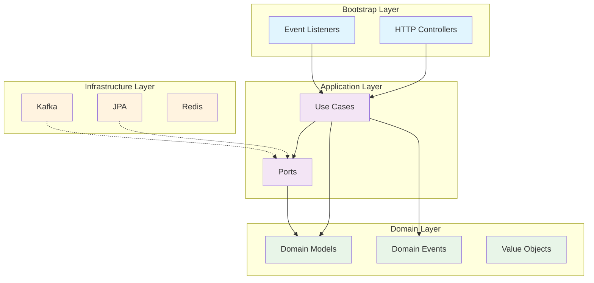

# coffeedia-backend

coffee + encyclopedia

 

## 기술스택

 

## Module Graph

 

## 아키텍처 설계

| **계층**               | **설명**                                                                  |
|----------------------|-------------------------------------------------------------------------|
| Bootstrap Layer      | HTTP, 이벤트 리스너, 스케줄러 등 외부 트리거를 받아 애플리케이션을 연결하는 진입점(http, event listener) |
| Application Layer    | 비즈니스 유즈케이스를 통해 도메인 객체들을 협력시키는 계층(usecase, port)                         |
| Domain Layer         | 핵심 비즈니스 로직과 규칙이 담긴 계층                                                   |
| Infrastructure Layer | 기술적 구현 세부사항을 담당하는 계층(port의 실제 구현체)                                      |

 

