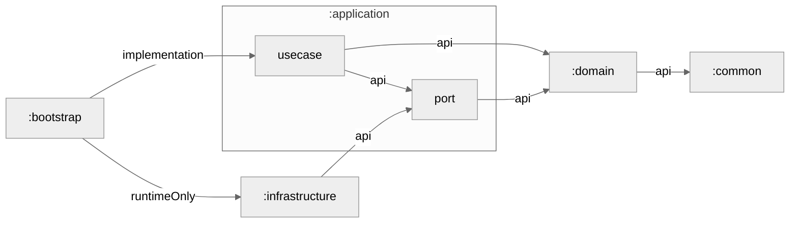

# coffeedia-backend

coffee + encyclopedia

 

## 기술스택

 

### Module Graph

```mermaid
%%{
  init: {
    'theme': 'neutral'
  }
}%%

graph LR
  subgraph :application
    :application:port["port"]
    :application:usecase["usecase"]
  end
  :domain -->|api| :common
  :infrastructure -->|api| :application:port
  :bootstrap -->|implementation| :application:usecase
  :bootstrap -->|runtimeOnly| :infrastructure
  :application:usecase -->|api| :domain
  :application:usecase -->|api| :application:port
  :application:port -->|api| :domain
```
