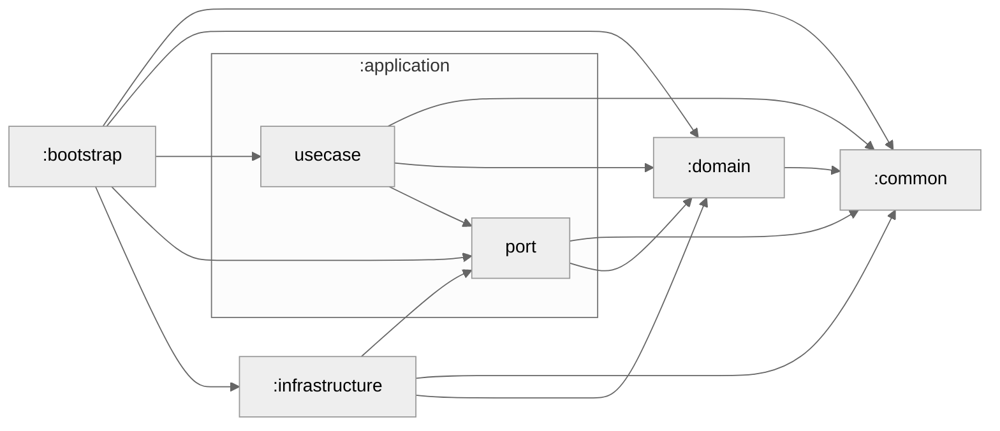

# coffeedia-backend
coffee + encyclopedia

### Module Graph

```mermaid
%%{
  init: {
    'theme': 'neutral'
  }
}%%

graph LR
  subgraph :application
    :application:port["port"]
    :application:usecase["usecase"]
  end
  :application:port --> :common
  :application:port --> :domain
  :infrastructure --> :common
  :infrastructure --> :domain
  :infrastructure --> :application:port
  :domain --> :common
  :bootstrap --> :common
  :bootstrap --> :domain
  :bootstrap --> :application:usecase
  :bootstrap --> :application:port
  :bootstrap --> :infrastructure
  :application:usecase --> :common
  :application:usecase --> :domain
  :application:usecase --> :application:port
```